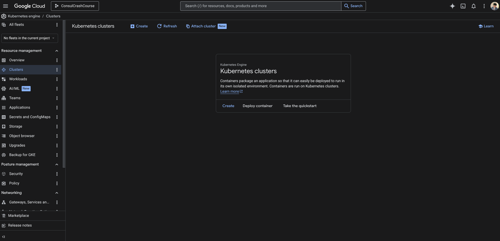
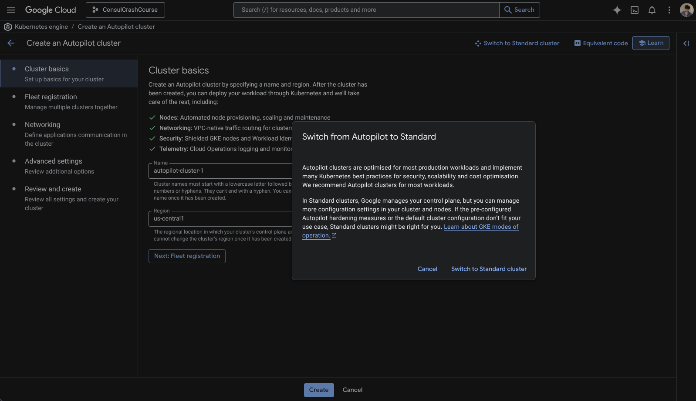
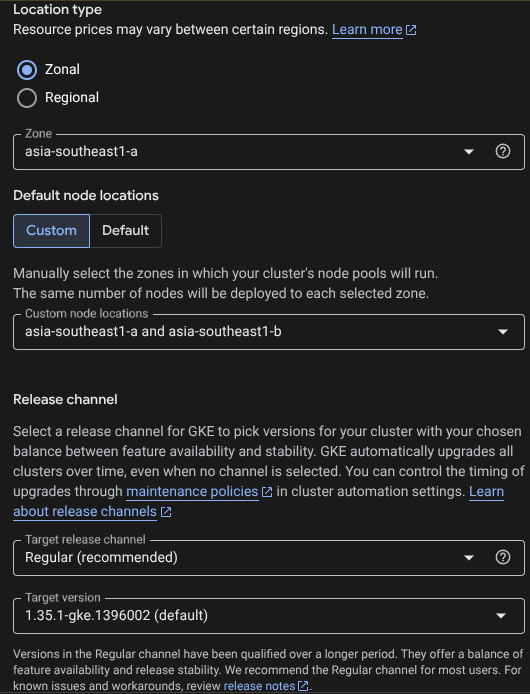
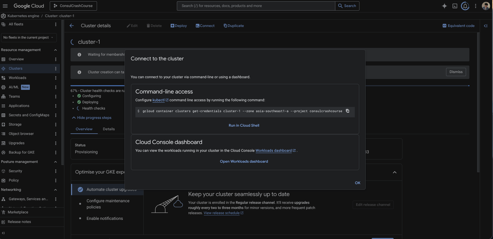
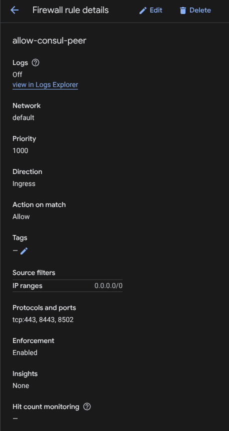
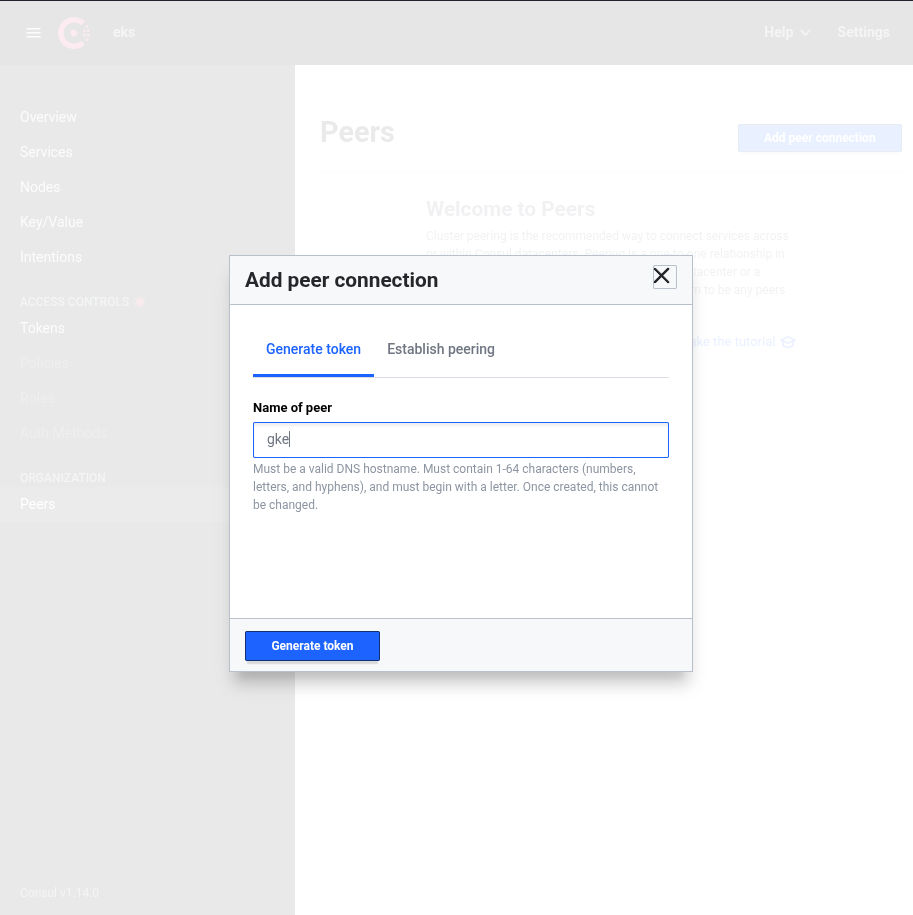
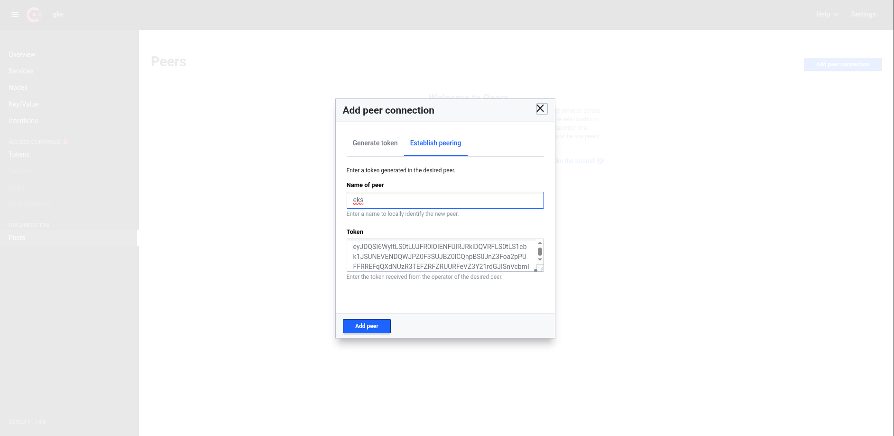

## Reference
1. Demo project accompanying a [Consul crash course video](https://www.youtube.com/watch?v=s3I1kKKfjtQ) on YouTube
2. This repository use publicly avaliable GCP Docker images within the Kubenetes deployment manifests, source of the project can be found at [GCP Demo project (Boutique)](https://github.com/GoogleCloudPlatform/microservices-demo)

## How to run

### Notes
Even though, Consul crash course video instruct us to use Linode, I have an issue during creation of its account.
So, I have decided to use Google Cloud Platform as an alternative as it will allow me to demonstrate understanding and usage of Consul as well.

### Prerequisite 
Following application/command line tool must be installed: 

1. AWS CLI
2. HELM 
3. Google Cloud CLI 
4. kubectl

### AWS-based service

1. Navigate to `terraform` directory: this is a home of AWS terraform files
2. Setup variable by creating `terraform.tfvars`. Following is example I used for mine.
```tfvars
aws_access_key_id     = "your-aws-access-key-id"
aws_secret_access_key = "your-aws-access-secret-key"
aws_region            = "ap-southeast-7"
```
3. Create infrastructure with terraform
```sh
cd terraform

# initialise project & download providers
terraform init

# exeucute with preview
terraform apply -var-file terraform.tfvars
```
3. configure AWS connection
```sh
# Configure connection using key id and secret key (same as in tfvars file)
aws configure

# configure kubectl context (region can be changed according to the region set in previous step)
aws eks update-kubeconfig --region ap-southeast-7 --name myapp-eks-cluster
```
3. After infrastructure is created, run application using `config.yaml` in `kubernetes` directory
```sh
cd ..
cd kubernetes

kubectl apply -f config.yaml
```
4. Wait for every pods to run, then you'll be able to access it via your web browser
```sh
# Check for pods status  (It should be all running except paymentservice)
kubectl get pods

# Check for service endpoint
kubectl get services
```
Example of get services, external IP is an IP of the loadbalancer that can be used to access the site
```sh
❯ kubectl get services
NAME                          TYPE           CLUSTER-IP       EXTERNAL-IP                                                                    PORT(S)                                                                            AGE
adservice                     ClusterIP      172.20.164.147   <none>                                                                         9555/TCP                                                                           24m
cartservice                   ClusterIP      172.20.129.36    <none>                                                                         7070/TCP                                                                           24m
checkoutservice               ClusterIP      172.20.13.40     <none>                                                                         5050/TCP                                                                           24m
currencyservice               ClusterIP      172.20.181.105   <none>                                                                         7000/TCP                                                                           24m
emailservice                  ClusterIP      172.20.197.75    <none>                                                                         5000/TCP                                                                           24m
frontend-external             LoadBalancer   172.20.109.23    aa7b6f9e18e2e460baca6afcbb1489e7-2111907473.ap-southeast-7.elb.amazonaws.com   80:30977/TCP                                                                       24m
kubernetes                    ClusterIP      172.20.0.1       <none>                                                                         443/TCP                                                                            40m
paymentservice                ClusterIP      172.20.239.48    <none>                                                                         50051/TCP                                                                          24m
productcatalogservice         ClusterIP      172.20.204.111   <none>                                                                         3550/TCP                                                                           24m
recommendationservice         ClusterIP      172.20.31.102    <none>                                                                         8080/TCP                                                                           24m
redis-cart                    ClusterIP      172.20.198.93    <none>                                                                         6379/TCP                                                                           24m
shippingservice               ClusterIP      172.20.139.210   <none>                                                                         50051/TCP                                                                          24m
```

5. Create gp3 volume
```sh
# ensure that you still on kubernetes directory
kubectl apply -f gp3-default.yaml
```
6. Register consul in your helm repositories
```sh
helm repo add hashicorp https://helm.releases.hashicorp.com
```

7. Install consul with following command
```sh
helm install eks hashicorp/consul --version 1.0.0 --values consul-values.yaml --set global.datacenter=eks
```

you may change its config as following
```sh
helm install <DEPLOYMENT-PREFIX> hashicorp/consul --version 1.0.0 --values consul-values.yaml --set global.datacenter=<DATACENTER-NAME>
```
After this, all services should be running. You can check using `kubectl get pods`

8. After all pods are running, check and connect to consul UI, you can check via `kubectl get services`

Examples:
```sh
❯ kubectl get services
NAME                          TYPE           CLUSTER-IP       EXTERNAL-IP                                                                    PORT(S)                                                                            AGE
adservice                     ClusterIP      172.20.164.147   <none>                                                                         9555/TCP                                                                           24m
cartservice                   ClusterIP      172.20.129.36    <none>                                                                         7070/TCP                                                                           24m
checkoutservice               ClusterIP      172.20.13.40     <none>                                                                         5050/TCP                                                                           24m
currencyservice               ClusterIP      172.20.181.105   <none>                                                                         7000/TCP                                                                           24m
eks-consul-connect-injector   ClusterIP      172.20.133.32    <none>                                                                         443/TCP                                                                            15m
eks-consul-dns                ClusterIP      172.20.30.170    <none>                                                                         53/TCP,53/UDP                                                                      15m
eks-consul-mesh-gateway       LoadBalancer   172.20.51.160    a79f3a94306b4413c8c27baffa5b44c2-482509621.ap-southeast-7.elb.amazonaws.com    443:30789/TCP                                                                      15m
eks-consul-server             ClusterIP      None             <none>                                                                         8501/TCP,8502/TCP,8301/TCP,8301/UDP,8302/TCP,8302/UDP,8300/TCP,8600/TCP,8600/UDP   15m
eks-consul-ui                 LoadBalancer   172.20.8.158     a9c45f14bfb7145b59705850d65c05c7-1534254856.ap-southeast-7.elb.amazonaws.com   443:31699/TCP                                                                      15m
emailservice                  ClusterIP      172.20.197.75    <none>                                                                         5000/TCP                                                                           24m
frontend-external             LoadBalancer   172.20.109.23    aa7b6f9e18e2e460baca6afcbb1489e7-2111907473.ap-southeast-7.elb.amazonaws.com   80:30977/TCP                                                                       24m
kubernetes                    ClusterIP      172.20.0.1       <none>                                                                         443/TCP                                                                            40m
paymentservice                ClusterIP      172.20.239.48    <none>                                                                         50051/TCP                                                                          24m
productcatalogservice         ClusterIP      172.20.204.111   <none>                                                                         3550/TCP                                                                           24m
recommendationservice         ClusterIP      172.20.31.102    <none>                                                                         8080/TCP                                                                           24m
redis-cart                    ClusterIP      172.20.198.93    <none>                                                                         6379/TCP                                                                           24m
```

The IP of your UI will be at `<DEPLOYMENT-PREFIX>-consul-ui`'s External IP (https protocol is required).

9. Change to Consul-ready configuration
```sh
# Delete previously created application
kubectl delete -f config.yaml

# Apply Consul-ready version
kubectl apply -f config-consul.yaml
```

### Google Cloud Platform-based failover
1. Setup your Google Cloud platform account at [GCP cloud console](https://console.cloud.google.com/)
2. Ensure you have project created
3. Navigate to Kubernetes Engine to create cluster (GCP requires us to enable Kubernetes Engine API)
4. To Create Kubernetes Cluster with 4 nodes. Its console will be at [https://console.cloud.google.com/kubernetes/list/overview](https://console.cloud.google.com/kubernetes/list/overview).



5. Ensure you use standard cluster (Google default is `autopilot`)



6. Select `Zonal` location type with `Default`



7. In `default-pool` set number of nodes to **4**. In `default-pool` select `Nodes`, to save cost we can select `e2-medium` with 50GB of boot disk size.
8. Press `Create`
9. Authenticate using same google account as your GCP
```sh
gcloud auth login
```
10. Click on `Connect` on Cloud Console, and copy the Command-line access, this command will give `kubectl` access to your kubernetes cluster. 



Troubleshooting: You might need to install gke-gcloud-auth plugin to connect, guide can be found [here](https://docs.cloud.google.com/kubernetes-engine/docs/how-to/cluster-access-for-kubectl#install_plugin)

11. Ensure kubectl connection using `kubectl get nodes`
Example:
```sh
❯ kubectl get nodes

NAME                                       STATUS   ROLES    AGE     VERSION
gke-cluster-1-default-pool-c2e7e6aa-b1ms   Ready    <none>   4m40s   v1.35.1-gke.1396002
gke-cluster-1-default-pool-c2e7e6aa-pmvx   Ready    <none>   4m40s   v1.35.1-gke.1396002
```

12. Install Consul using helm (as mention before prefix and datacenter name can be changed, it is currently named to reflect the provider.)
```sh
helm install gke hashicorp/consul --version 1.0.0 --values consul-values.yaml --set global.datacenter=gke
```

13. Check all creation using `kubectl get all`
14. After all pods status becomes `Running`, apply Kubernetes file using following commands
```sh
kubectl apply -f config-consul.yaml
```

15. Check running services using `kubectl get svc`
Example:
```sh
❯ kubectl get svc
NAME                          TYPE           CLUSTER-IP       EXTERNAL-IP      PORT(S)                                                                            AGE
adservice                     ClusterIP      34.118.231.122   <none>           9555/TCP                                                                           75s
cartservice                   ClusterIP      34.118.229.29    <none>           7070/TCP                                                                           75s
checkoutservice               ClusterIP      34.118.231.186   <none>           5050/TCP                                                                           74s
currencyservice               ClusterIP      34.118.235.163   <none>           7000/TCP                                                                           76s
emailservice                  ClusterIP      34.118.238.74    <none>           5000/TCP                                                                           77s
frontend-external             LoadBalancer   34.118.234.98    35.247.187.167   80:31723/TCP                                                                       74s
gke-consul-connect-injector   ClusterIP      34.118.226.236   <none>           443/TCP                                                                            4m14s
gke-consul-dns                ClusterIP      34.118.234.99    <none>           53/TCP,53/UDP                                                                      4m14s
gke-consul-mesh-gateway       LoadBalancer   34.118.237.68    34.21.164.126    443:31023/TCP                                                                      4m14s
gke-consul-server             ClusterIP      None             <none>           8501/TCP,8502/TCP,8301/TCP,8301/UDP,8302/TCP,8302/UDP,8300/TCP,8600/TCP,8600/UDP   4m14s
gke-consul-ui                 LoadBalancer   34.118.234.68    34.124.134.40    443:31242/TCP                                                                      4m14s
kubernetes                    ClusterIP      34.118.224.1     <none>           443/TCP                                                                            13m
paymentservice                ClusterIP      34.118.236.228   <none>           50051/TCP                                                                          77s
productcatalogservice         ClusterIP      34.118.236.56    <none>           3550/TCP                                                                           76s
recommendationservice         ClusterIP      34.118.229.94    <none>           8080/TCP                                                                           77s
redis-cart                    ClusterIP      34.118.231.180   <none>           6379/TCP                                                                           73s
shippingservice               ClusterIP      34.118.239.9     <none>           50052/TCP                                                                          75s
```
16. Ensure that you create firewall rule for Source IP `0.0.0.0/0` or AWS IP. for `tcp:8443`, `tcp:443`, and `tcp:8502`



### Connecting Peer
Check context using `kubectl config get-contexts` and change it to AWS context using `kubectl config use-context <Target-Context>`

1. Apply(GKE) `consul-mesh-gateway` to both cluster
```sh
kubectl apply -f consul-mesh-gateway.yaml
```
2. Check mesh creation using
```sh
kubectl get mesh
```
3. Switch to AWS context with commands above and repeat step 1 and 2
4. Inside EKS (AWS based Consul UI) add peer called `gke` (name can be changed)



5. Copy the generated Token
6. Go to GKE (Google Based Consul) established peer connection using copied token and name it `eks`



### Configure Failover
1. Ensure you are using GKE (Google Cloud) as Kubernetes context.
2. Apply exported Service, ensure that peer name in `exported-service.yaml` matched your registered peer name i.e., `eks`.
```sh
kubectl apply -f exported-service.yaml
```
3. Ensure that `eks` peer in GKE (Google Cloud) shows exported service `shippingservice` with status active
4. Ensure that `gke` peer in EKS (AWS) shows imported service `shippingservice` with status active, and shows `gke` in as peer on shipping service (services page)
5. Switch to AWS Kubernetes context
6. Apply `service-resolver` to configure failover. Ensure that `peer` name is match with your registered name
```sh
kubectl apply -f service-resolver.yaml
```
7. To test failover functionality, delete `shippingservice` deployments in AWS
```sh
kubectl delete deployments shippingservice
```
Your cart page should work correctly as it resolve to GCP based deployments.

## Alternation from Techworld with Nana's script
1. Shift from LKE to GKE, `service-resolver.yaml` edited to use `peer: gke` instead `peer: lke`
2. AWS Infrastructure Upgrades, change EKS cluster's Kubernetes version from `1.27` to `1.30`. Upgrade EC2 instance type to `t3.medium` as `t2.small` does not applicable in Thailand's region.
3. Add `gp3-default.yaml` as `gp2` fails to create for Consul
4. Terraform Provider Version Upgrade, upgrade AWS provider version from `~>5.3` to `~>5.83`
